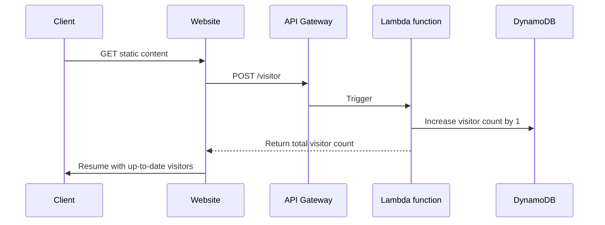

# Cloud Resume Challenge

Series of challenges, which deepen AWS knowledge and provide an opportunity to perform technical experience using AWS.
The main goal is to create and deploy the static website hosting a resume of the pretender.

The additional steps include integrating it with database, providing an API, using automation for building, testing and deploying the code and the infrastructure and many others.
Apart from standard objective, most of the steps include optional extensions recommendation. They are different from the core task and focus on practicing concrete set of skills in one of the specific areas.

The area of interest chosen by me to do those extensions if possible is ***DevOps***.

## Benefits of the challenge

After completing the challenge, the practitioner is able to gain multiple skills, related (but not limited) to AWS ecosystem:

- Software Development (Frontend / Backend perspective)
- IaC (Infrastructure as Code) using CloudFormation, SAM, CDK
- CI/CD (AWS CodeBuild, AWS CodeDeploy, AWS CodePipeline)
- Serverless Architecture on AWS (Lambda, API Gateway, DynamoDB, S3)
- Security (IAM, bucket policies, API authentication/authorization)
- Networking (DNS if using Route53, ALB, Routing/IP traffic if creating own VPCs/subnets)
- many more!

## Challenge stages

### Stage 0 - Certification

First challenge is to complete [AWS Cloud Practitioner](https://aws.amazon.com/certification/certified-cloud-practitioner/) certification exam.\
I [successfully passed](https://www.credly.com/badges/7dd19137-0b34-47b3-8e50-6d3acf195a16/public_url) the exam on 20.01.2023

### Stage 1 - Creating Front End

This section is about building the visual representation of resume using plain HTML, CSS and JavaScript (which gets more important on stage 2).

#### HTML

The resume should be created using HTML. It does not have to be pretty or contain sublime styling, because the challenge is not about ideal styling and responsive web design.
I've used grid + flex displays to create two a simple layout:

| Cell 00: Short summary           | Cell 01: Social links             |
| -------------------------------- | --------------------------------- |
| Cell 10: Work experience section | Cell 11: Technical skills section |
| Cell 20: Education section       | Cell 21: Certificates section     |
| Cell 30: Footer section          | Cell 31: Footer section           |

#### CSS

The resume should be just a little styled using *CSS*, to somewhat resemble the actual resume document.

#### JavaScript

The resume should include simple JS script for counting number of visitors.\
The first version is using `localStorage` class as a counter storage, later migrating to *AWS DynamoDB* for storing the visitors.

#### Static assets

The resume contains multiple icons in *SVG* format.\
All of them were downloaded under the [iconmonstr license](https://iconmonstr.com/license/) from [iconmonstr.com](https://iconmonstr.com/share-11-svg/).

#### CloudFront

The resume page is available only via CloudFront Distribution Name.\
The S3 Bucket serving the static content is private - OAC (Origin Access Control) is configured and associated with CloudFront Distribution to allow entering the resume page only from CDN.\
The requests from HTTP are redirected to HTTPS.
CloudFront Distribution is contained within `template.yaml` as a part of Infrastructure as Code setup.

#### Q&A

- What aspect of Chunk 1's work did you
  find the most difficult?
  - Going directly for IaC paradigm and creating resources using CloudFormation / SAM Template
- Note one or two problems you
  overcame to get the static site deployed
  - By Default, The AWS S3 had a Bucket ACLs enabled, which was preventing me from applying bucket policy.
    To fix this, I had to dig deep into AWS CloudFormation Documentation for S3 and find corresponding properties to set
- What's something you'd have done time?
  - I'd set automatic distribution ID discovery for CloudFront in the GitHub Actions (as of now, the distribution ID is set as secret and deleting the whole stack would require to update the distribution ID for cache invalidation)
  - Completing DevOps mode for this stage taught me how to provide CI/CD for cloud-based deployment and how easy is to roll out the changes if the infrastructure is implemented using IaC paradigm

### Stage 2 - Building the API

This section is about extending local visitor counter (written in JavaScript) to a full API which saves the values in AWS DynamoDB database.

#### Database

The visitor counter is saved and retrieved from a single Table in AWS DynamoDB.\
There is a single Item (record) in DynamoDB table, which gets constantly updated when a new visitor opens the page.

| Primary key                | Attributes |
| -------------------------- | ---------- |
| Partition key: CounterName | count      |
| visitors                   | 10         |

#### API

The JavaScript code is not talking directly to the DynamoDB.\
Instead, Amazon API Gateway is set with one POST route, triggering/proxying request to Lambda function responsible for updating a visitor counter.

#### Python

Lambda Function, responsible for handling the business logic of an application (in this case, updating and returning overall visitors count) is written using Python *3.9*, which is the latest runtime version supported by the Lambda [as of writing this section](https://docs.aws.amazon.com/lambda/latest/dg/lambda-runtimes.html) (01.04.2023).

The Python code is tested using `pytest` framework and `moto` library (for mocking AWS resources) and test cases can be found inside `src/backend/tests/` directory.\
All the versions of required frameworks,libraries and plugins for Python are defined in `requirements.txt` in `src/backend/lambda` directory.

### Stage 3 - Frontend & Backend integration

This section is about embedding the value coming from DynamoDB through AWS Lambda into the JavaScript code, making the page dynamically count and display the visitors number.

#### Dynamic counter value

The script responsible for retrieving and updating the counter is found in `src/frontend/scripts/visitCounter.js` file.\
It makes an HTTP POST request to the API Gateway endpoint in order to retrieve & update counter value on each DOM load.

### Step 4 - Automation & CI/CD

#### Infrastructure as Code (IaC)

All AWS resources are defined as *CloudFormation*/*SAM Template* from the beginning. The deployment is using an *AWS SAM CLI* to upload the "state" file to the AWS S3 Bucket and create requested resources.

#### CI/CD

To streamline the configuration changes, the deployment is not done manually, but rather executed in an automated manner using GitHub Actions and a dedicated pipeline workflow.\
All steps and stages can be seen in `.github/workflows/pipeline.yaml` file.

The pipeline automatically:

- runs tests for both frontend (Cypress) and backend (Pytest)
- on success of backend tests, it starts to build and deploy the SAM Template.
- invalidates the CloudFront cache to allow accessing website with latest features instead of relying on local cache.
- Synchronizes the assets (.html, .css, .img) files which could come up in a PR with S3 bucket
