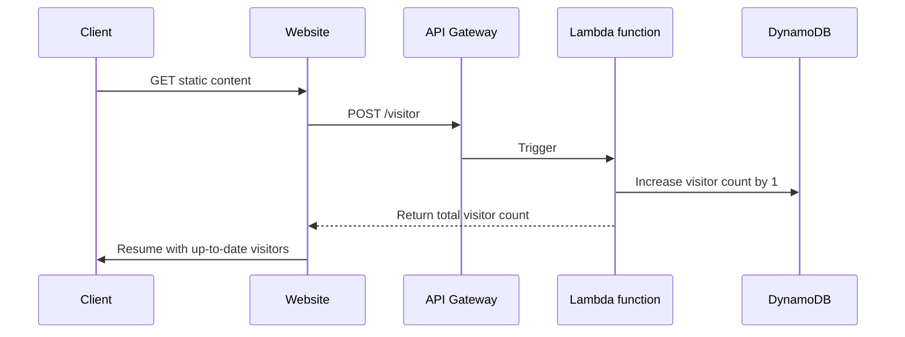

# Cloud Resume Challenge

Series of challenges, which deepen AWS knowledge and provide an opportunity to perform technical experience using AWS.
The main goal is to create and deploy the static website hosting a resume of the pretender.

The additional steps include integrating it with database, providing an API, using automation for building, testing and deploying the code and the infrastructure and many others.
Apart from standard objective, most of the steps include optional extensions recommendation. They are different from the core task and focus on practicing concrete set of skills in one of the specific areas.

The area of interest chosen by me to do those extensions if possible is ***DevOps***.

## Benefits of the challenge

After completing the challenge, the practitioner is able to gain multiple skills, related (but not limited) to AWS ecosystem:

- Software Development (Frontend / Backend perspective)
- IaC (Infrastructure as Code) using CloudFormation, SAM, CDK
- CI/CD (AWS CodeBuild, AWS CodeDeploy, AWS CodePipeline)
- Serverless Architecture on AWS (Lambda, API Gateway, DynamoDB, S3)
- Security (IAM, bucket policies, API authentication/authorization)
- Networking (DNS if using Route53, ALB, Routing/IP traffic if creating own VPCs/subnets)
- many more!

## Challenge stages

### Stage 0 - Certification

First challenge is to complete [AWS Cloud Practitioner](https://aws.amazon.com/certification/certified-cloud-practitioner/) certification exam.\
I [successfully passed](https://www.credly.com/badges/7dd19137-0b34-47b3-8e50-6d3acf195a16/public_url) the exam on 20.01.2023

### Stage 1 - Creating Front End

This section is about building the visual representation of resume using plain HTML, CSS and JavaScript (which gets more important at stage 2).

#### 1.1 HTML

The resume should be created using HTML. It does not have to be pretty or contain sublime styling, since the challenge is not about perfect styling and responsive web design.
I've used grid + flex displays to create two a simple layout:

| Cell 00: Short summary           | Cell 01: Social links             |
| -------------------------------- | --------------------------------- |
| Cell 10: Work experience section | Cell 11: Technical skills section |
| Cell 20: Education section       | Cell 21: Certificates section     |
| Cell 30: Footer section          | Cell 31: Footer section           |

#### 1.2 CSS

The resume should be just a little styled using *CSS*, to somewhat resemble the actual resume document.

#### 1.3 JavaScript

The resume should include simple JS script for counting number of visitors.\
The first version was using `localStorage` class as a counter storage and then migrated to *AWS DynamoDB* Table for storing the visitors.

#### 1.4 Static assets

The resume contains multiple icons in *SVG* format.\
All of them were downloaded under the [iconmonstr license](https://iconmonstr.com/license/) from [iconmonstr.com](https://iconmonstr.com/share-11-svg/).

#### 1.5 CloudFront

The resume page is accessible only via CloudFront Distribution.\
The S3 Bucket serving the static content has all all public access blocked - [OAC](https://docs.aws.amazon.com/AmazonCloudFront/latest/DeveloperGuide/private-content-restricting-access-to-s3.html) is configured with said S3 bucket as the origin with the bucket only allowing requests from CloudFront OAC.\
The requests from HTTP are redirected to HTTPS.

### Stage 2 - Building the API

This section is about extending local visitor counter (written in JavaScript) to a full API which saves the values in AWS DynamoDB database.

#### 2.1 Database

The visitor counter is saved and retrieved from a single Table in AWS DynamoDB.\
There is a single Item (record) in DynamoDB table, which gets constantly updated when a new visitor opens the page.

| Primary key                | Attributes |
| -------------------------- | ---------- |
| Partition key: CounterName | count      |
| visitors                   | 10         |

#### 2.2 API

The JavaScript code is not talking directly to the DynamoDB.\
Instead, Amazon API Gateway is set with one POST route, proxying request to a Lambda function responsible for updating a visitor counter.

#### 2.3 Python

Lambda Function, responsible for handling the business logic of an application (in this case, updating and returning overall visitors count) is written using Python *3.9*, which is the latest runtime version supported by the Lambda [as of writing this section](https://docs.aws.amazon.com/lambda/latest/dg/lambda-runtimes.html) (01.04.2023).

**UPDATE 10.05.2023**: Python runtime upgraded to version 3.10, with preserved back-compatibility support for Python3.9

The Python code is tested using `pytest` framework and `moto` library (for mocking AWS resources) and test cases can be found inside `src/backend/tests/` directory.\
All the versions of required frameworks,libraries and plugins for Python are defined in `requirements.txt` in `src/backend/lambda` directory.

### Stage 3 - Frontend & Backend integration

This section is about embedding the value coming from DynamoDB through AWS Lambda into the JavaScript code, making the page dynamically count and display the visitors number.

#### 3.1 Dynamic counter value

The script responsible for retrieving and updating the counter is found in `src/frontend/scripts/visitCounter.js` file.\
It makes an HTTP POST request to the API Gateway endpoint in order to retrieve & update counter value on each DOM load.

### Step 4 - Automation & CI/CD

#### 4.1 Infrastructure as Code (IaC)

All AWS resources are provided via [Terraform](https://www.terraform.io/) wrapper [Terragrunt](https://terragrunt.gruntwork.io/).\
The main usage of Terragrunt in this project is to provide a dynamic backend/providers configuration/ for each resource, thus reducing the code duplication. It also allows for deploying all the resources onto different environments more easily, by creating a set of common configuration options, inherited by all child modules.

- `api_gateway-lambda/` - Contains API Gateway nad Lambda resources. They are placed in a single directory because both have dependencies on each other.
- `dynamodb/` - Contains DynamoDB Table resource definition
- `s3-cloudfront/` - Contains S3 Bucket and CloudFront Distribution, OAC resources. They are placed in a single directory because both have dependencies on each other.

Because `api_gateway-lambda/` resources have dependency on both `dynamodb/` and `s3-cloudfront/`, you should first deploy the resources from those directories. Enter the corresponding directory and run

> The Project is natively using S3 Bucket as a backend for storing the state.\
> You should have existing S3 Bucket ready and export its name as a environment variable `export STATE_S3_BUCKET=<NAME OF YOUR BUCKET>`

`terragrunt init`

To download all required providers and modules, then run

`terragrunt apply`

To see what is being deployed and after confirming the changes, enter `yes` to start the deployment.

> The Python code is archived during the deployment of AWS Lambda. This requires the same Python version to be available locally. I recommend using [pyenv](https://github.com/pyenv/pyenv) to manage multiple Python versions on your system and create a virtual environment with the corresponding version before running Terragrunt. You can see all the Python run-times supported by AWS Lambda [here](https://docs.aws.amazon.com/lambda/latest/dg/lambda-runtimes.html).

#### 4.2 CI/CD

To streamline the configuration changes, the deployment is not done manually, but rather executed in an automated manner using GitHub Actions and a dedicated pipeline workflow.\
All steps and stages can be seen in `.github/workflows/pipeline.yaml` file.

The pipeline automatically:

- runs tests for both frontend (Cypress) and backend (Pytest)
  - Cypress smoke tests are run AFTER the infrastructure has been successfully deployed
  - Backend tests using Pytest library are executed at the beginning of the pipeline and have to pass in order for deployment to proceed
- on success of backend tests:
  - Terraform init is run to download all providers and modules
  - Terraform plan is executed and posted as a comment in the Pull Request
  - The configuration is applied only, when PR is successfully merged to the `main` branch.
- invalidates the CloudFront cache to allow accessing website with latest features instead of relying on local cache.
- Synchronizes the assets (.html, .css, .img) files which could come up in a PR with S3 bucket.
